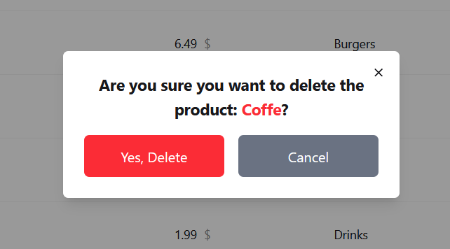

# UI Examples

## 1. Main Page 
contians all products details and ability to add to cart , filter and search by name

## 2. Search
search feature by key stroke

## 3. Filter
filter by category feature

## 4. Cart Page 
cart page list of all cart items ability to increment,decrement and reset quantity and delete item from cart 

## 5. Admin Products Page
listing all products for admin 

## 6. Add Product
add new product

## 7. Confirm Add Product
notification to confirm successful add new product

## 8. Update Product
Update existing product

## 9. Confirm Add Product
notification to confirm successful update product

## 10. Delete Product
Delete existing product

## 11. Error while deleting
notification to inform a failure while deleting product

## 12. Confirm Delete Product
notification to confirm successful delete product

